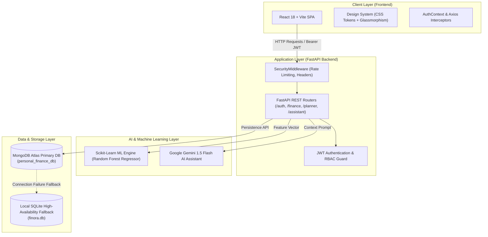

# 💎 Finora AI — Intelligent Personal Finance Analyzer & Future Financial Planning System

[](https://python.org)
[](https://fastapi.tiangolo.com)
[](https://reactjs.org)
[](https://vitejs.dev)
[](https://mongodb.com)
[](https://scikit-learn.org)
[](https://ai.google.dev)
[](LICENSE)

---

## 🌟 Executive Overview

**Finora AI** is an enterprise-grade, full-stack personal finance management and financial forecasting platform. Powered by **FastAPI**, **React**, **Scikit-Learn Random Forest Regression**, and **Google Gemini AI**, Finora AI empowers users to analyze spending habits, predict monthly savings potential, build targeted wealth plans, and receive context-aware financial advisory in real-time.

Designed with high-contrast glassmorphic aesthetics, adaptive dark/light modes, and a resilient database strategy (**MongoDB Atlas primary with high-availability SQLite fallback**), Finora AI delivers modern fintech UI/UX alongside Machine Learning and Generative AI.

---

## 🚀 Key System Features

### 🤖 1. ML Savings & Financial Intelligence
* **Random Forest Regressor Engine**: Predicts monthly savings, expenditure forecasts, and budget capacity based on **87 financial parameters**.
* **Worksheet Data Ingestion**: Upload custom financial CSV/Excel datasets for automated validation, feature mapping, and instant predictive inference.
* **Financial Health Index**: Real-time aggregated health score calculation based on income-to-expense ratios, emergency buffer, debt burden, and savings rate.

### 💬 2. Gemini-Powered AI Financial Assistant
* **Context-Aware Wealth Coach**: Integrates directly with Google Gemini AI to analyze user income, expense patterns, active budgets, and savings goals.
* **Smart Financial Q&A**: Answers questions on tax savings, portfolio allocation, debt payoff strategies, and inflation protection with personalized advice.

### 🎯 3. Future Financial Planning Suite
* **Retirement Planning**: Monte Carlo-inspired projection engine estimating nest egg requirements, FIRE targets, and inflation-adjusted monthly income needs.
* **Debt Optimization Matrix**: Compare **Debt Snowball** vs. **Debt Avalanche** payoff schedules with dynamic interest savings visualizers.
* **Goal Progress Tracker**: Track short-term and long-term milestones (e.g., House Downpayment, Emergency Fund, Travel) with milestone alerts.
* **Spending Anomaly Detector**: Real-time detection of high-risk transactions and abnormal spending spikes.

### 🛡️ 4. Admin Command Center & User Management
* **Role-Based Access Control (RBAC)**: Distinct permissions for `user` and `admin` roles secured via JWT Bearer Tokens.
* **Platform Metrics Dashboard**: Track active user accounts, total ML predictions executed, system health index, and platform utilization.
* **Feedback Management**: Inspect, filter, and delete user feedback submissions directly from the command center.

### 📄 5. Automated PDF & Excel Reporting
* **Executive Summary Downloads**: Export full financial health audits, forecast breakdowns, and budget matrices as clean PDF reports or Excel sheets.

---

## 🏗️ System Architecture



---

## 📁 Repository Directory Structure

```text
Finora_Ai/
├── backend/                        # FastAPI Backend Application
│   ├── config.py                   # Centralized Configuration & Environment Settings
│   ├── main.py                     # App Entry Point & Middleware Pipeline
│   ├── middleware/                 # Security, Rate Limiting & Header Middlewares
│   ├── routes/                     # REST API Endpoint Controllers
│   │   ├── assistant.py            # Gemini AI Chat Endpoints
│   │   ├── auth.py                 # Registration, Login, Token Refresh & User Management
│   │   ├── finance.py              # ML Predictions, Datasets, Feedback & Admin Stats
│   │   ├── planner.py              # Goals, Retirement, Debt Optimizer & Anomalies
│   │   ├── reports.py              # PDF / Excel Report Generation
│   │   └── search.py               # Global Search Capabilities
│   ├── services/                   # Business Logic & Integration Services
│   │   ├── db_service.py           # MongoDB Atlas Primary & High-Availability SQLite Layer
│   │   ├── gemini_service.py       # Google Gemini AI Integration Service
│   │   ├── ml_service.py           # Random Forest ML Inference & Preprocessing
│   │   ├── pdf_service.py          # PDF Generation Engine
│   │   └── validation_service.py   # Dataset & Schema Validation Pipeline
│   ├── utils/                      # Auth Helpers, Password Hashing & Logger Modules
│   └── tests/                      # Pytest & Unittest Test Suites
├── frontend/                       # React 18 + Vite + TailwindCSS Frontend Application
│   ├── src/
│   │   ├── components/             # Reusable UI Components & Layouts
│   │   │   ├── SidebarLayout.tsx   # Adaptive Navigation & Main Workspace Layout
│   │   │   └── FeedbackModal.tsx   # User Feedback Submission Modal
│   │   ├── contexts/               # React Context Providers (Auth, Theme)
│   │   ├── pages/                  # Top-Level Page Views
│   │   │   ├── AdminPage.tsx       # Admin Command Center
│   │   │   ├── AdvisorPage.tsx     # Gemini AI Financial Advisor
│   │   │   ├── DashboardPage.tsx   # Executive Financial Overview
│   │   │   ├── DataUploadPage.tsx  # ML Dataset Ingestion & Forecasting
│   │   │   ├── LandingPage.tsx     # Interactive Hero Landing Page
│   │   │   ├── LoginPage.tsx       # User & Admin Authentication
│   │   │   ├── PlannerPage.tsx     # Future Financial Planning Tools
│   │   │   ├── ProfilePage.tsx     # Account Settings & Security
│   │   │   ├── RegisterPage.tsx    # User Onboarding
│   │   │   └── ReportsPage.tsx     # Report Exports
│   │   ├── styles/                 # Design System CSS (Variables, Glass, Utilities)
│   │   └── utils/                  # Axios API Client & Dynamic Chart Generators
│   ├── index.html
│   ├── tailwind.config.js
│   └── vite.config.ts
├── dataset/                        # Training Financial Datasets
│   └── Personal_Finance_Analyzer.csv
├── model/                          # Machine Learning Artifacts
│   ├── Personal_Finance_Model.pkl  # Trained Random Forest Regressor
│   ├── categorical_mappings.json   # Preprocessing Mappings
│   ├── column_medians.json         # Feature Imputation Values
│   └── feature_columns.json        # 87 Model Feature Definitions
├── scripts/                        # Utility & Audit Scripts
│   ├── train_and_evaluate_ml.py   # Model Retraining Script
│   └── audit_ml.py                 # Feature Integrity Audit
├── .env.example                    # Sample Environment Template
├── .gitignore                      # Security & Exclusion Rules
├── requirements.txt                # Python Dependencies
└── README.md                       # Project Documentation
```

---

## ⚡ Quick Start & Setup Guide

### 📋 Prerequisites
* **Python**: `3.10` or higher
* **Node.js**: `18.x` or higher
* **MongoDB Atlas Cluster**: (or local MongoDB / SQLite fallback)

---

### 1️⃣ Clone the Repository
```bash
git clone https://github.com/SangramPise448/Finora_Ai.git
cd Finora_Ai
```

---

### 2️⃣ Backend Setup (FastAPI)

1. **Create and Activate Virtual Environment**:
   ```bash
   # Windows (PowerShell)
   python -m venv .venv
   .\.venv\Scripts\Activate.ps1

   # Linux / macOS
   python3 -m venv .venv
   source .venv/bin/activate
   ```

2. **Install Python Dependencies**:
   ```bash
   pip install -r requirements.txt
   ```

3. **Configure Environment Variables**:
   Create a `.env` file in the root directory (refer to `.env.example`):
   ```env
   DEBUG=True
   JWT_SECRET=your_jwt_secret_key_here
   JWT_REFRESH_SECRET=your_jwt_refresh_secret_key_here
   ACCESS_TOKEN_EXPIRE_MINUTES=15
   REFRESH_TOKEN_EXPIRE_DAYS=7

   # Database Configuration
   MONGODB_URI=mongodb+srv://<username>:<password>@cluster0.xxx.mongodb.net/personal_finance_db?appName=Cluster0
   DB_NAME=personal_finance_db

   # Gemini AI API Key
   GEMINI_API_KEY=your_google_gemini_api_key
   ```

4. **Start Backend Server**:
   ```bash
   python -m uvicorn backend.main:app --host 127.0.0.1 --port 8000 --reload
   ```
   * **API Docs**: Available at `http://127.0.0.1:8000/docs`

---

### 3️⃣ Frontend Setup (React + Vite)

1. **Navigate to Frontend Directory & Install Dependencies**:
   ```bash
   cd frontend
   npm install
   ```

2. **Launch Frontend Development Server**:
   ```bash
   npm run dev
   ```
   * **Application URL**: Access at `http://localhost:5173`

---

## 🔑 Key API Endpoints Reference

| Method | Endpoint | Description | Auth Required |
| :--- | :--- | :--- | :---: |
| `POST` | `/auth/register` | Register a new user account | ❌ |
| `POST` | `/auth/login` | Authenticate user & receive JWT access + refresh tokens | ❌ |
| `GET` | `/auth/me` | Fetch active user profile | 🔒 User |
| `GET` | `/auth/users` | List all registered user accounts | 🛡️ Admin |
| `DELETE` | `/auth/users/{user_id}` | Permanently delete user account & records | 🛡️ Admin |
| `POST` | `/finance/predict` | Predict monthly savings using Random Forest ML | 🔒 User |
| `POST` | `/finance/upload-dataset` | Ingest CSV/Excel dataset & generate predictions | 🔒 User |
| `GET` | `/finance/admin/stats` | Aggregate platform metrics & health score | 🛡️ Admin |
| `POST` | `/assistant/chat` | Interact with Gemini 1.5 Flash AI Advisor | 🔒 User |
| `GET` | `/reports/pdf` | Generate and download executive PDF report | 🔒 User |

---

## 📊 Machine Learning Model Architecture

The ML subsystem uses a **Random Forest Regressor** trained on historical personal finance indicators:
* **Features Extracted**: `Income`, `Rent`, `Utilities`, `Groceries`, `Entertainment`, `Debt Payments`, `Savings Ratios`, `Age`, `Dependents`, `Discretionary Income Ratio`, `Emergency Fund Ratio`, etc. (**87 features total**).
* **Imputation & Normalization**: Median imputation for missing values with categorical integer encoding (`column_medians.json`, `categorical_mappings.json`).
* **Evaluation**: Achieved **high $R^2$ accuracy** on monthly net savings estimation.

---

## 🛡️ Security & Resilience Architecture

1. **Database High-Availability Strategy**:
   - **Primary**: MongoDB Atlas Cloud Database (`personal_finance_db`).
   - **Fallback**: Automated, zero-downtime transition to local **SQLite** (`finora.db`) if cloud database is unreachable.
2. **Authentication Security**:
   - BCrypt password hashing with high salt rounds.
   - Dual-token JWT architecture (Short-lived Access Tokens + Long-lived Refresh Tokens).
   - Middleware rate-limiting against brute force attacks.
3. **Data Privacy**:
   - `.env` and sensitive credentials strictly excluded from git tracking via `.gitignore`.

---

## 🤝 Contributing

Contributions are welcome! If you'd like to improve Finora AI:
1. Fork the Repository.
2. Create a Feature Branch (`git checkout -b feature/AmazingFeature`).
3. Commit your Changes (`git commit -m 'Add some AmazingFeature'`).
4. Push to the Branch (`git push origin feature/AmazingFeature`).
5. Open a Pull Request.

---

## 📄 License

Distributed under the **MIT License**. See `LICENSE` for details.

---

<p center>
  Made with ❤️ by <b>Sangram Pise</b>
</p>
